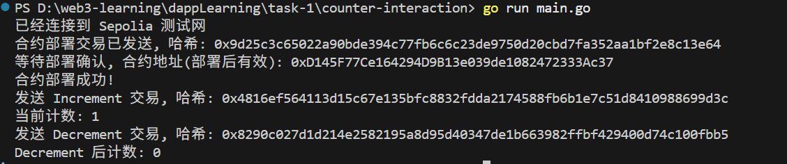

## 任务 2：合约代码生成 任务目标
使用 abigen 工具自动生成 Go 绑定代码，用于与 Sepolia 测试网络上的智能合约进行交互。
 具体任务
1. 编写智能合约
   - 使用 Solidity 编写一个简单的智能合约，例如一个计数器合约。
   - 编译智能合约，生成 ABI 和字节码文件。
2. 使用 abigen 生成 Go 绑定代码
   - 安装 abigen 工具。
   - 使用 abigen 工具根据 ABI 和字节码文件生成 Go 绑定代码。
3. 使用生成的 Go 绑定代码与合约交互
   - 编写 Go 代码，使用生成的 Go 绑定代码连接到 Sepolia 测试网络上的智能合约。
   - 调用合约的方法，例如增加计数器的值。
   - 输出调用结果。

配置说明：
需要有一个.env文件
里面有两个参数，一个参数PRIVATE_KEY用来记录钱包账户私钥，第二个参数SEPOLIA_RPC记录合约需要部署的网络节点