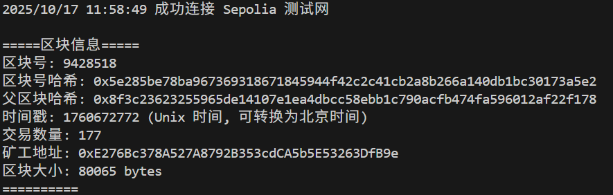
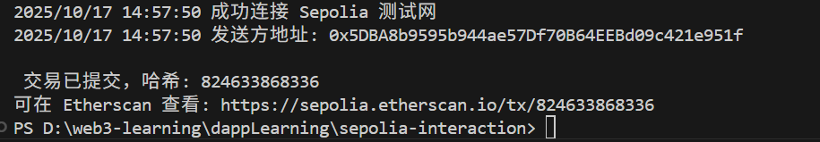

## 任务 1：区块链读写 任务目标
使用 Sepolia 测试网络实现基础的区块链交互，包括查询区块和发送交易。
 具体任务
1. 环境搭建
   - 安装必要的开发工具，如 Go 语言环境、 go-ethereum 库。
   - 注册 Infura 账户，获取 Sepolia 测试网络的 API Key。
2. 查询区块
   - 编写 Go 代码，使用 ethclient 连接到 Sepolia 测试网络。
   - 实现查询指定区块号的区块信息，包括区块的哈希、时间戳、交易数量等。
   - 输出查询结果到控制台。
   
3. 发送交易
   - 准备一个 Sepolia 测试网络的以太坊账户，并获取其私钥。
   - 编写 Go 代码，使用 ethclient 连接到 Sepolia 测试网络。
   - 构造一笔简单的以太币转账交易，指定发送方、接收方和转账金额。
   - 对交易进行签名，并将签名后的交易发送到网络。
   - 输出交易的哈希值。
   