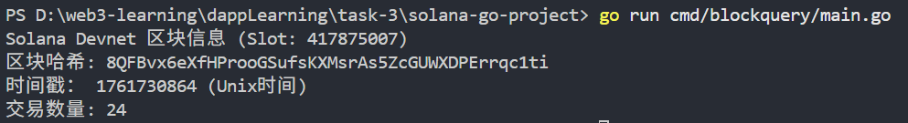
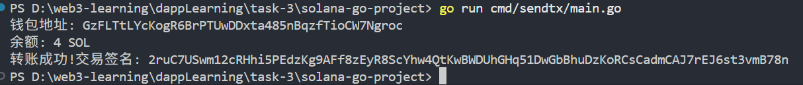

# Solana-Go 开发实战作业

## 作业目的
掌握Solana区块链核心交互模式，理解Go语言SDK的架构设计与实现原理

## 任务分解
### 基础链交互（40%）
1. 实现区块数据查询
```go
// 获取最新区块
resp, _ := rpcClient.GetRecentBlockhash(context.TODO())
fmt.Printf("Latest blockhash: %s\n", resp.Value.Blockhash)



// 查询账户余额
account, _ := rpcClient.GetBalance(
    context.TODO(),
    solana.MustPublicKeyFromBase58("钱包地址"),
)


2. 构造原生转账交易
instruction := system.NewTransferInstruction(
    from.PublicKey(),
    to.PublicKey(),
    lamports,
).Build()

tx, _ := solana.NewTransaction(
    []solana.Instruction{instruction},
    recentBlockhash,
    solana.TransactionPayer(from.PublicKey()),
)



智能合约开发（30%）
1. 使用CLI生成合约骨架
solana-program-cli new --lang=go token-swap 
mv token-swap /Users/zhujie/workspace/rcc/projects/nft-market/solana-go/programs

2. 生成Go绑定代码
anchor generate --lang=go --path=./programs/token-swap

事件处理（30%）
1. 实时交易订阅
wsClient, _ := ws.Connect(context.Background(), rpc.DevNet_WS)
sub, _ := wsClient.SignatureSubscribe(
    solana.MustSignatureFromBase58("交易签名"),
    "",
)

作业要求
1. 技术报告需包含：
  - Solana交易生命周期流程图
  - BPF加载器工作原理图
  - 账户存储模型对比（vs EVM）

┌─────────────┐     编译     ┌──────────────┐     部署     ┌─────────────────┐  
│ 开发者代码   │  ───────→   │ BPF字节码     │  ───────→   │ 链上程序账户      │  
│（Rust/C等）  │             │（.so文件）    │             │（存储字节码）    │  
└─────────────┘             └──────────────┘             └────────┬────────┘  
                                                                 │  
┌─────────────┐     触发     ┌──────────────┐     加载    ┌──────▼────────┐     执行     ┌──────────────┐  
│ 用户交易     │  ───────→   │ BPF加载器    │  ───────→    │ BPF虚拟机(VM)  │  ───────→   │ 状态更新     │  
│（调用程序）  │             │（管理部署/执行）│            │（JIT编译+安全检查）│             │（账户数据变更）│  
└─────────────┘             └──────────────┘             └───────────────┘             └──────────────┘  

2. 代码提交：
  - 事件监听服务实现

参考资料
1. 官方Go SDK文档：<https://pkg.go.dev/github.com/gagliardetto/solana-go>
2. 核心源码路径：
/solana-go
├── rpc      // 区块链通信协议
├── system   // 原生指令实现
└── token    // SPL代币标准

评分标准：功能完整性40%、代码质量30%、架构合理性30%

该作业重点训练以下能力：
1. 链交互：通过<mcsymbol name="client.NewRPCClient" filename="rpc/client.go" path="/Users/zhujie/workspace/rcc/projects/nft-market/solana-go/rpc/client.go" startline="58" type="function"></mcsymbol>源码分析网络层实现
2. 合约安全：通过程序派生地址（PDA）实现防重放攻击
3. 性能优化：基于Solana的并行执行特性设计高吞吐量服务