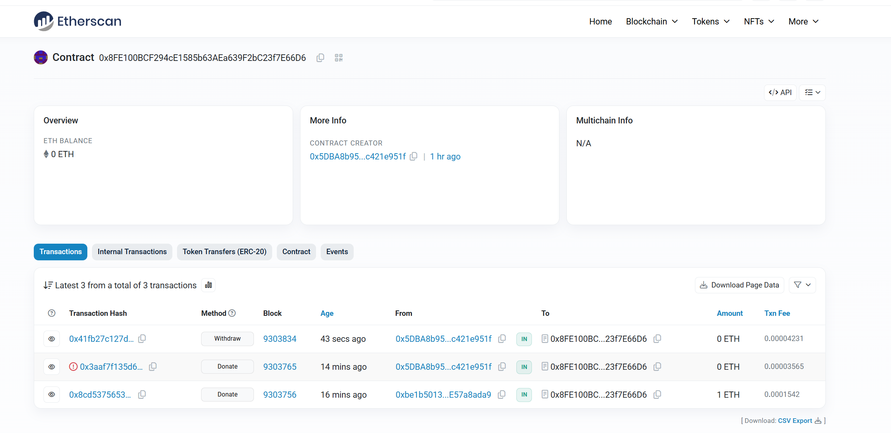

作业3：编写一个讨饭合约
任务目标
1. 使用 Solidity 编写一个合约，允许用户向合约地址发送以太币。
2. 记录每个捐赠者的地址和捐赠金额。
3. 允许合约所有者提取所有捐赠的资金。

任务步骤
1. 编写合约
  - 创建一个名为 BeggingContract 的合约。
  - 合约应包含以下功能：
  - 一个 mapping 来记录每个捐赠者的捐赠金额。
  - 一个 donate 函数，允许用户向合约发送以太币，并记录捐赠信息。
  - 一个 withdraw 函数，允许合约所有者提取所有资金。
  - 一个 getDonation 函数，允许查询某个地址的捐赠金额。
  - 使用 payable 修饰符和 address.transfer 实现支付和提款。
2. 部署合约
  - 在 Remix IDE 中编译合约。
  - 部署合约到 Goerli 或 Sepolia 测试网。
3. 测试合约
  - 使用 MetaMask 向合约发送以太币，测试 donate 功能。
  - 调用 withdraw 函数，测试合约所有者是否可以提取资金。
  - 调用 getDonation 函数，查询某个地址的捐赠金额。

任务要求
1. 合约代码：
  - 使用 mapping 记录捐赠者的地址和金额。
  - 使用 payable 修饰符实现 donate 和 withdraw 函数。
  - 使用 onlyOwner 修饰符限制 withdraw 函数只能由合约所有者调用。
2. 测试网部署：
  - 合约必须部署到 Goerli 或 Sepolia 测试网。
3. 功能测试：
  - 确保 donate、withdraw 和 getDonation 函数正常工作。

提交内容
1. 合约代码：提交 Solidity 合约文件（如 BeggingContract.sol）。
2. 合约地址：提交部署到测试网的合约地址。
3. 测试截图：提交在 Remix 或 Etherscan 上测试合约的截图。

额外挑战（可选）
1. 捐赠事件：添加 Donation 事件，记录每次捐赠的地址和金额。
2. 捐赠排行榜：实现一个功能，显示捐赠金额最多的前 3 个地址。
3. 时间限制：添加一个时间限制，只有在特定时间段内才能捐赠。

合约部署地址：0x8FE100BCF294cE1585b63AEa639F2bC23f7E66D6
Etherscan上的交易截图：
